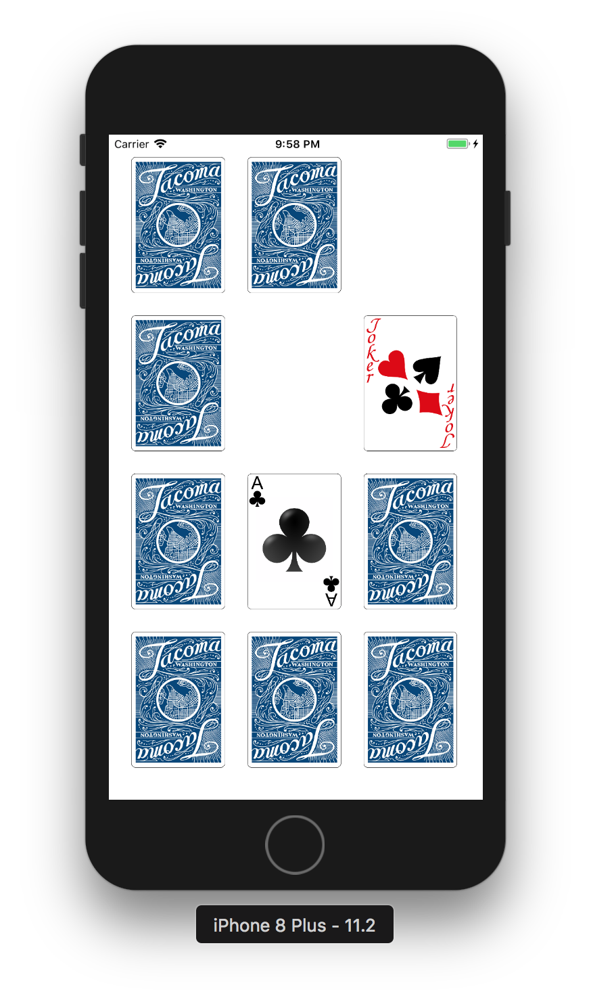

# Swift 카드 매칭 게임
> 2018.02.04 업데이트

## 실습 내용
   

> 카드 매칭 게임

Custom View를 통해 반복적으로 들어가는 카드를 클래스로 만들어서 카드 매칭 게임을 만들었다.

### 카드 Custom View 구문
```swift
import UIKit

/// 카드 앞면(UIimageView)와 뒷면(UIButton)을 만들어 주는 클래스
class CreateCard: UIView {
    
    // 카드 앞면과 뒷면을 구분하여 뷰로 만든다.
    var frontCardImgView: UIImageView?
    var frontCardImg: UIImage?
    var backCardImg: UIImage?
    var cardBtn: UIButton?
    
    // 카드를 눌렀을때 보여주는 이미지
    var selectImg: UIImage?
    
    convenience init() {
        self.init(frame: CGRect.zero)
    }
    
    override init(frame: CGRect) {
        super.init(frame: frame)
    }
    
    required init?(coder aDecoder: NSCoder) {
        fatalError("init(coder:) has not been implemented")
    }
    
    func addTarget(_ target: Any?, action: Selector, for controlEvents: UIControlEvents) {
        cardBtn?.addTarget(target, action: action, for: controlEvents)
    }
    
    /// 카드의 앞면과 뒷면을 만들어주는 함수
    func setCard(){
        // 카드의 앞면을 입력하는 구문
        frontCardImgView = UIImageView()
        frontCardImgView!.frame = CGRect(x: 0, y: 0, width: self.frame.size.width, height: self.frame.size.height)
        self.addSubview(frontCardImgView!)
        // 카드 귓면 이미지
        backCardImg = UIImage(named: "cardBack")
        // 카드를 누르고 있을때 보여지는 이미지
        selectImg = UIImage(named: "cardSelect")
        
        // 카드 뒷면을 입력하는 구문
        cardBtn = UIButton(type: .custom)
        cardBtn!.setBackgroundImage(backCardImg!, for: .normal)
        cardBtn!.setBackgroundImage(selectImg!, for: .highlighted)
        cardBtn!.frame = CGRect(x: 0, y: 0, width: self.frame.size.width, height: self.frame.size.height)
        self.addSubview(cardBtn!)
    }
    
    /// 카드의 앞면 이미지 튜플이 들어오면 그것을 받아서 카드 앞면에 정의하는 함수
    ///
    /// - Parameter cTuple: String: 카드 이름, Int: 카드의 태그 번호
    func mixCard(cTuple: (String, Int)){
        frontCardImg = UIImage(named: cTuple.0)
        frontCardImgView!.image = frontCardImg
        cardBtn!.tag = cTuple.1
    }
    
}
```
> UIButton으로 클래스를 만들어 selected일때 카드 앞면이 보이도록 할 수 있었지만, UIView를 이용해서 만들어 보려고 했다.